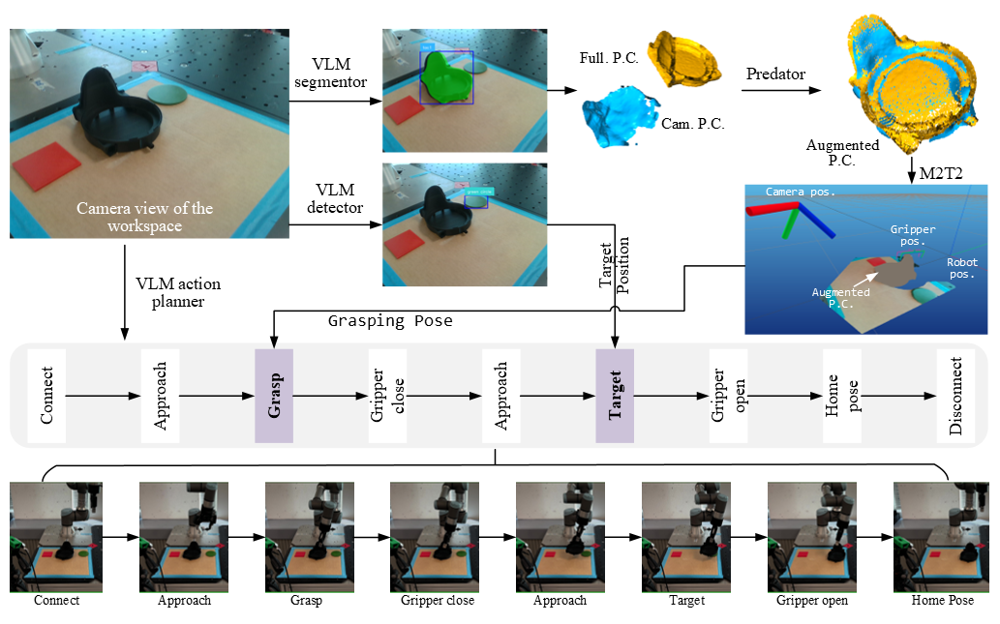

# VL-GRiP3: A Hierarchical Pipeline Leveraging Vision-Language Models for Autonomous Robotic 3D Grasping

VL_GRiP3 is an end-to-end pipeline for **vision–language-driven grasping** on a UR3 robot with a Robotiq gripper.




High-level flow:

1. Capture RGB-D with **RealSense**
2. Segment the commanded object + detect the target area with **PaliGemma**
3. Register the CAD model to the scene with **OverlapPredator**
4. Generate grasp candidates with **M2T2**
5. Decode a high-level action script from language + image (PaliGemma action head)
6. Execute the sequence on the UR3 via **RTDE**


## Installation
This code has been tested on

- Python 3.10.19, PyTorch 2.3.1+cu121, CUDA 12.1, NVIDIA RTX 4090 (24GB VRAM)


## Requirements

To create an environment and install the required dependencies please run:

### Option A: Conda

```bash
git clone https://github.com/AU-DK-Robotics/VL-GRiP3.git
cd VL-GRiP3
conda env create -f environment.yml
conda activate grip3
```

### Option B: virtualenv + pip

```bash
git clone https://github.com/AU-DK-Robotics/VL-GRiP3.git
cd VL-GRiP3
python3 -m venv grip3
source grip3/bin/activate
pip install --upgrade pip
pip install -r requirements.txt
```

Example command:

```text
move tac1 in red target
move tac2 in green target
move tac3 in yellow target


GRiP3_Pipeline/
├─ checkpoints/
│  ├─ paligemma-segm-module/       # Segmentation head weights (PEFT)
│  └─ paligemma-action-module/     # Action command head weights (PEFT)
│  
│
├─ sample_data/
│  └─ real_world/
│     └─ XY/
│        ├─ rgb.png                # Captured RGB (RealSense)
│        ├─ depth.npy              # Captured depth (RealSense)
│        ├─ meta_data.pkl          # Camera intrinsics, extrinsics, etc. for M2T2
│        ├─ seg.png                # Segmentation mask (PaliGemma)
│        ├─ segmentation_overlay.png
│        ├─ detection_target_overlay.png
│        ├─ target_pose.json       # Target XY in robot frame
│        ├─ scene.pth              # Scene point cloud for Predator
│        ├─ full_object_pointcloud.npz
│        │                         # Registered object+scene cloud for M2T2
│        ├─ best_poses.json        # Best grasps/placements (M2T2)
│        └─ sorted_tcp_poses.json  # Sorted TCP poses for UR3Commands
│
└─ utils/
   ├─ class_get_snap_mm.py         # RealSenseCapture (RGB + depth grabber)
   ├─ class_paligemma.py           # PaliGemmaInference (seg/detect/command)
   ├─ class_predator.py            # PredatorPipeline (scene.pth + OverlapPredator + NPZ)
   ├─ class_m2t2.py                # M2T2Inference (loads config.yaml + runs grasping)
   ├─ class_robot_library.py       # UR3Commands + RobotiqGripper (RTDE control)
   ├─ class_whisper                # Whisper class
   ├─ ft_action_module.py          # Script to fine-tune the action (command) PaliGemma head
   └─ ft_segm_module.py            # Script to fine-tune the segmentation PaliGemma head


